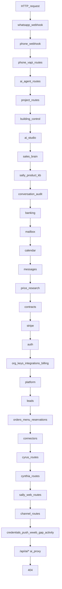
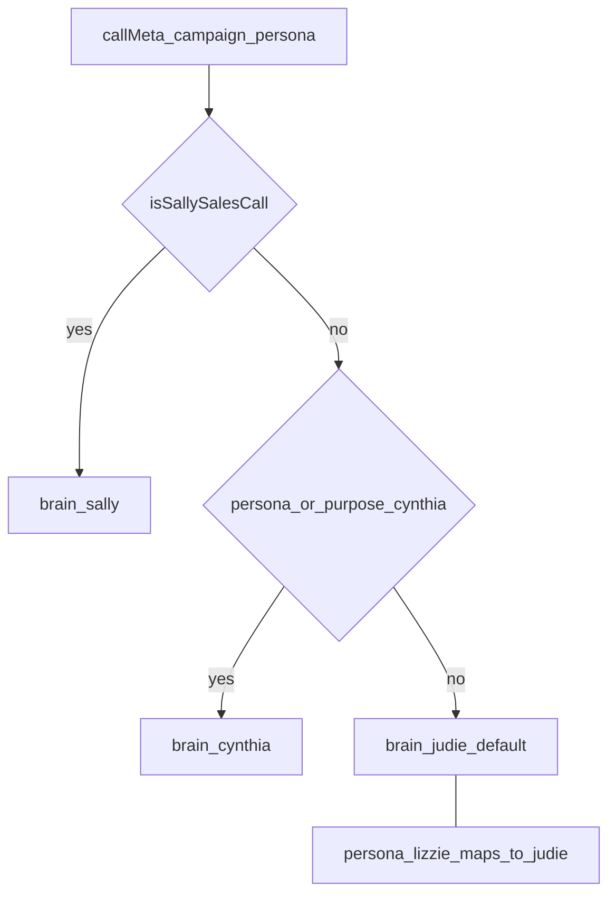
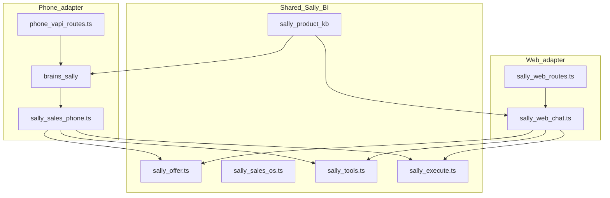
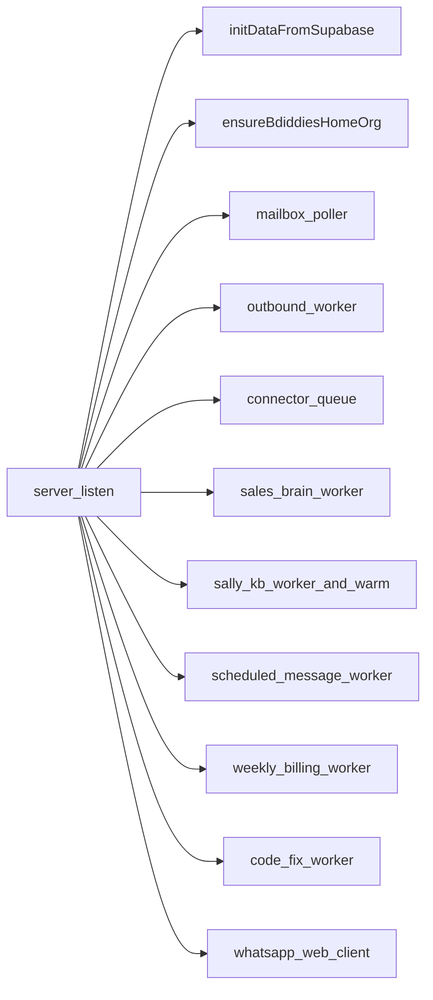
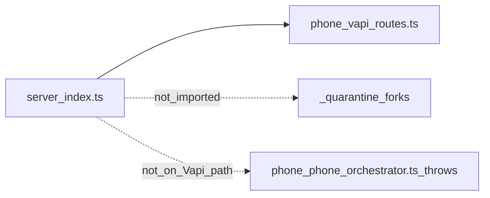

# Sync2Dine backend architecture diagrams (code-verified)

Generated 2026-07-23 from `server/index.ts`, `server/brains/index.ts`, domain folders.  
Do not treat quarantine or FE archives as runtime.

## HTTP dispatch (mount order)

Sequential handlers in `server/index.ts`. First match wins; `/api/ai/*` is the final API catch-all before 404.

Not mounted: `server/analytics-routes.ts`.

## Phone brain selection

Verified from `server/brains/index.ts`.

## Sally layers

Verified from `docs/SALLY_ARCHITECTURE.md` paths that exist in tree: `server/sally/*`, `server/phone/sally-sales-phone.ts`, `server/brains/sally`.

## Boot workers

Started after `listen` in `server/index.ts`.

## Quarantine boundary

